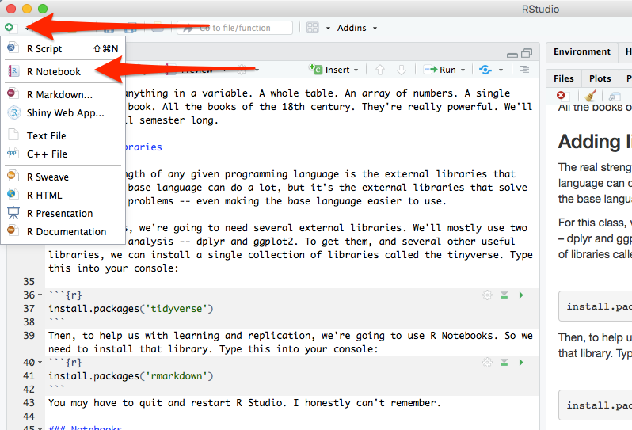

First, to do much of this, we need to install stuff. 

* Install [Slack](https://slack.com/get) on your computer and your phone. Send me an email with an address you want me to invite you to Slack through. Then send me a message in Slack after you get signed up. 
* If on a Mac, [install the Command Line Tools](http://osxdaily.com/2014/02/12/install-command-line-tools-mac-os-x/).
* Install [R for your computer](https://rweb.crmda.ku.edu/cran/).
* Install [R Studio Desktop for your computer](https://www.rstudio.com/products/rstudio/download/#download) ONLY AFTER YOU HAVE INSTALLED R

### Notebooks

For the rest of the class, we're going to be working in notebooks. In notebooks, you will both run your code and explain each step, much as I am doing here. 

To start a notebook, you click on the green plus in the top left corner and go down to R Notebook. Do that now. 

To add text, simply type. To add code you can click on the *Insert* button on the toolbar or by pressing *Cmd+Option+I* on Mac or *Ctl+Option+I* on PC.

To run your code after you add it, click the green triangle on the right side of your code chunk. 

When you save the notebook, an HTML file containing the code and output will be saved alongside it (click the *Preview* button or press *Cmd+Shift+K* to preview the HTML file). 

The preview shows you a rendered HTML copy of the contents of the editor. Consequently, unlike *Knit*, *Preview* does not run any R code chunks. Instead, the output of the chunk when it was last run in the editor is displayed.

### Assignment

Create an R notebook (which you should have done earlier). In it, fill in the top matter and write a sentence below it. Don't care what. Then add a code block and add two numbers together. Run that code block. Save the file and submit the .Rmd file created when you save it. That's it. Simple.